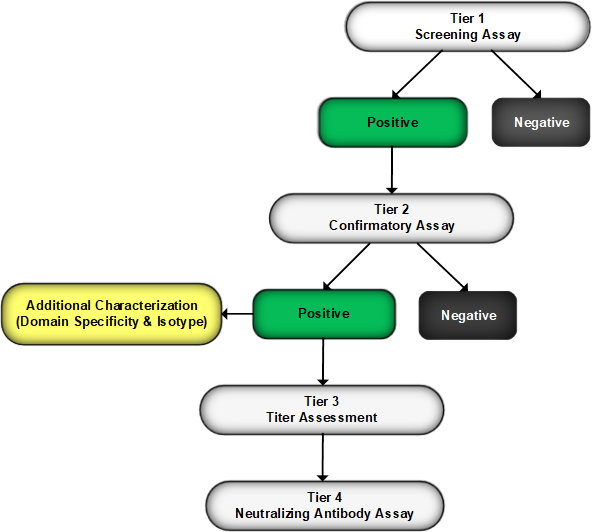

<style type="text/css">

slides > slide:before {
  font-size: 12pt;
  content: 'http://shiny.rstudio.com/';
  position: absolute;
  text-align: center;
  bottom: 15px;
  left: 50%;  
  margin-left: -300px;
  width: 600px;
  line-height: 1.9;
}

div.img-col{
  text-align: center;
  font-size: 14pt;
}

a {
  border-bottom: none !important;
}

.wrapper {
  margin: 70px auto;
  position: relative;
  z-index: 90;
}

.ribbon-wrapper-green {
  width: 145px;
  height: 148px;
  overflow: hidden;
  position: absolute;
  top: -3px;
  right: -3px;
}

.ribbon-green {
  font: bold 15px Sans-Serif;
  color: #333;
  text-align: center;
  text-shadow: rgba(255,255,255,0.5) 0px 1px 0px;
  -webkit-transform: rotate(45deg);
  -moz-transform:    rotate(45deg);
  -ms-transform:     rotate(45deg);
  -o-transform:      rotate(45deg);
  position: relative;
  padding: 7px 0;
  left: -25px;
  top: 45px;
  width: 220px;
  background-color: #7ADCBF;
  background-image: -webkit-gradient(linear, left top, left bottom, from(#8AACDF), to(#658FBE)); 
  background-image: -webkit-linear-gradient(top, #8AACDF, #658FBE); 
  background-image:    -moz-linear-gradient(top, #8AACDF, #658FBE); 
  background-image:     -ms-linear-gradient(top, #8AACDF, #658FBE); 
  background-image:      -o-linear-gradient(top, #8AACDF, #658FBE); 
  color: #6a6340;
  -webkit-box-shadow: 0px 0px 3px rgba(0,0,0,0.3);
  -moz-box-shadow:    0px 0px 3px rgba(0,0,0,0.3);
  box-shadow:         0px 0px 3px rgba(0,0,0,0.3);
}

.ribbon-green:before, .ribbon-green:after {
  content: "";
  border-top:   3px solid #00896e;   
  border-left:  3px solid transparent;
  border-right: 3px solid transparent;
  position:absolute;
  bottom: -3px;
}

.ribbon-green:before {
  left: 0;
}
.ribbon-green:after {
  right: 0;
}
</style>

# Shiny Day Workshop

## My Story & How I Got Here
### About:
 - CS Background
 - B2S Life Sciences
 - Book Note - Statistical Methods for Immunogenicity Assessment
 
# Biopharmaceuticals

## Top 10 U.S. Drugs

- https://en.wikipedia.org/w/index.php?title=List_of_largest_selling_pharmaceutical_products
- https://www.fiercepharma.com/special-report/top-20-drugs-2020-worldwide-sales
- Monoclonal antibodies now comprise the predominant category of the biotherapeutics undergoing development

## Protein Drugs – Increased Size... Results in Increased Complexity

- Unlike traditional small molecule drugs, they posses a high ordered structure
- Oxytocin 1,007 Da
- Insulin 5,808 Da
- Therapeutic mAb 150,000 Da
- Safety and Efficacy concerns, Assessment of Biosimilarity
- Monoclonal, Polyclonal Antibody

## What is Immunogenicity?
- Immunogenicity is characterized by the presence of antidrug antibodies (ADAs) detected in the circulation of either animals or humans after administration of a biopharmaceutical
- Ability of an agent to provoke an immune response
- Traditional small molecule drugs rarely elicit formation of antibodies
- Repeated administration of biotech drugs frequently results in unwanted formation of ADA (anti-drug Abs)
- Two types: “Wanted” -> Vaccines & “Unwanted” -> ADA (anti-drug Abs) [Van Beers et al. 2010]
- Therapeutic use of monoclonal antibodies is often associated with immunogenicity (Remicade USPI 2015)

## FDA’s Immunogenicity Draft Guidance (Dec. 2009)
- https://www.fda.gov/downloads/Drugs/Guidances/UCM192750.pdf
- Evaluating the immunogenicity of biopharmaceuticals is mandatory for regulatory approval


## Tiered Process - Testing Scheme for Detection & Characterization of ADA

<div class="columns-4"></a>

</div>

## Schaarschmidt et al - R!

- Statistical approaches for the determination of cut points in anti-drug antibody bioassays
- https://www.ncbi.nlm.nih.gov/pubmed/25733352
- "All methods discussed are available in the corresponding R add-on package mixADA"
- Normalization assuming normal and log-normal distribution 
- Testing normal vs. log-normal distribution in the mixed model
- "Therefore, our approach, which is mirrored in mixADA software, is a parallel estimation of the SCP assuming an underlying normal and log-normal distribution"
- "Specific R algorithms were provided and summarized in the user-friendly program mixADA, providing diagnostic tools and optional model choice"


## Development Process
- ["I created a quick plot, that then turned into a R Notebook, that then turned into an interactive dashboard."](https://www.linkedin.com/pulse/its-nonlinear-world-interactive-dashboard-edgar-ruiz/)

## Workshop Goals - Workshop has 3 Parts

### You will learn:
- Setup
- From ploting to...
- Dashboards to...
- Apps

## Outline

### We'll Cover Four Main Areas:
<div class="columns-2">
- GGplot2
- R Markdown
- Shiny
- Deploying via RStudio Connect

<div class="img-col">

   
 </div>
</div>


 
 
 
 

## Freedom to Build...

- “This is your world...You’re the creator...Find freedom on this canvas...Believe, that you can do it, ‘Cuz you can do it. You can do it. Bob Ross"
- The Karate Kid
- Hungry & Passionate
- Focus on what students want to do
- Activate Learning
- Project based learning
- Mental Models
- Cognitive Load


# Part 1 Setup

## Setup

- R
- Packages
- IDE
- Projects
- Sessions
- RSC
- Repeatable & Reproducible

# Part 2 GGplot2

## Empowered to Build Powerful Visualizations, Reports & Apps
- ["R is a fantastic environment for the rapid exploration of in-memory data"](https://peadarcoyle.wordpress.com/2015/08/02/interview-with-a-data-scientist-hadley-wickham/)
- http://www.acop7.org/previous-acop-meetings-acop7-posters


## Common Reporting Tasks - ggplot2

<div class="columns-2">
- [Plotting system for R](https://rpubs.com/hadley/ggplot2-toolbox)
- [Created by Hadley Wickham](http://ggplot2.org/)
- [Powerful graphics language for creating elegant and complex plots](http://www.cookbook-r.com/Graphs/)
- [ggplot2 is a graphing library for R. Use ggplot2 with Plotly to create interactive, online ggplot2 charts with D3.js.](https://plot.ly/ggplot2/)
- [ggvis is a data visualization package for R](http://ggvis.rstudio.com/)

<div class="img-col">
<a href="https://ramnathv.github.io/pycon2014-r/visualize/ggplot2.html"></a>


</div>

## A ggplot2 template - Make any plot by filling in the parameters of this template

```{r}
#ggplot(data = <DATA>) +
#<GEOM_FUNCTION>(mapping = aes(<MAPPINGS>))
```

```{r fig.height = 3, fig.width = 5}
library(ggplot2)
ggplot(data = mpg) +
geom_point(mapping = aes(x = displ, y = hwy))
```

## What are Adverse Events (AEs)?
- The openFDA drug adverse event API returns data from the FDA Adverse Event Reporting System (FAERS)
- FAERS, a database that contains information on adverse event and medication error reports submitted to FDA
- An adverse event is submitted to the FDA to report any undesirable experience associated with the use of a medical product in a patient
- Adverse events are collected through a series of safety reports
- Adverse event reports submitted to FDA do not undergo extensive validation or verification
- http://www.gersonides.com/openfda/
- https://open.fda.gov/data/faers/


## OpenFDA Analysis

<div class="columns-2">
- [ropenhealth/openfda](https://github.com/rOpenHealth/openfda)
- [openFDA API endpoint for adverse drug events](https://open.fda.gov/drug/event/)
- [openfda-dashboard information](https://github.com/statwonk/openfda-dashboard/blob/master/about2.Rmd)
- [openFDA reference guide](https://open.fda.gov/drug/event/reference/)
- [Ten things to know about drug adverse events](https://open.fda.gov/update/ten-things-to-know-about-adverse-events/)

<div class="img-col">
<a href="https://open.fda.gov/update/drilling-into-the-details/"></a>


</div>

</div>

## Your Turn 1

- 02_GGplot2_adverse_events_plots


# Part 3 R Markdown

## R Notebooks

<div class="columns-2">
- [Notebooks](http://rmarkdown.rstudio.com/r_notebooks.html)
- [Notebook Background](https://rviews.rstudio.com/2017/03/15/why-i-love-r-notebooks/)
- Leonardo da Vinci…Page from the Codex Atlanticus shows notes and images about water wheels and Archimedean Screws
- Combine in a single document: Narrative, Code, Output & then Render to HTML

<div class="img-col">
<a href="https://blog.rstudio.com/2016/10/05/r-notebooks/"></a>

</div>

## Your Turn 2
- 01_RMD_openfda_Notebook


## R Markdown - Benefits & Features

<div class="columns-2">
 - Markdown is a particular type of markup language.
 - Markup languages are designed produce documents from plain text.
 - Existing R code can be used within R Markdown & reports can be parameterized
 - Easy creation of dynamic documents, presentations, and reports
 - Framework for writing reproducible reports from R
 - https://bookdown.org/yihui/rmarkdown/
 - https://www.youtube.com/watch?v=HVlwNayog-k
 
<div class="img-col">
   
 </div>
</div>

## Live R Markdown Pharma Examples

<div class="columns-2">
- [Monitor Clinical Research](https://jenthompson.me/2018/02/09/flexdashboards-monitoring/)
- [Cancer prediction using caret by JESUS M. CASTAGNETTO](https://rpubs.com/jesuscastagnetto/caret-knn-cancer-prediction)
- [TCGA prostate cancer differential expression by race
by Levi Waldron](https://rpubs.com/lwaldron/TCGA_prad)
- [GLMM with various R packages
by Kazuki Yoshida](https://rpubs.com/kaz_yos/glmm1)
- [A not so short review on 
survival analysis in R](http://rpubs.com/alecri/258589)
- [Access to Hospital Care Dashboard](http://colorado.rstudio.com/rsc/content/154/)
- [Comparative Protein Structure Analysis with Bio3D](http://rpubs.com/xqyao/bio3d_pca)
- [Survival Analysis Example](https://rpubs.com/mjeagle/Surv)

<div class="img-col">
 </div>

</div>

## What can I do with RMD?

- Write a book http://adv-r.had.co.nz/
- Write a blog https://rviews.rstudio.com
- Create a website http://rmarkdown.rstudio.com/
- Add a vignette to a package http://yihui.name/knitr/demo/vignette/
- Publish research https://github.com/rstudio/rticles
- Automate reporting https://github.com/philbowsher/Job-Scheduling-R-Markdown-Reports-via-R
- Make PowerPoints https://github.com/nwstephens/rmd2ppt
- Create scientific/technical docs https://rstudio.github.io/radix/
- Preserve your sanity and look back at your workflow

## Using R Markdown - How to Build a Document - Installation & Structure

 - Comes installed with the RStudio IDE
 - File Template - within RStudio
 - ["Add R code - Code Chunks"](http://rmarkdown.rstudio.com/authoring_rcodechunks.html) 
 - 
 - ["R Markdown Cheat Sheet"](http://shiny.rstudio.com/articles/rm-cheatsheet.html) 
 - Enhance with Shiny functions and R code
 - Utilize Chunk Options - echo=FALSE, results="hide", include=FALSE, warning=FALSE & message=FALSE 
 - Global chunk options
 
## Example R Markdown Doc -- `Example.RMD`

- Create a new R Markdown document in the IDE by going to 'File' and select 'New File' and select 'R Markdown...' and create a new document and leave output as HTML
<div class="columns-4"></a> </div>

- Then select Knit and save it as Example.RMD </td>
<td></td>
</tr>
</table>

## Your Turn
- 2_RMD_Stocks
- 2_RMD_openFDA


## rmarkdown Parameters -- `2_RMD_Stocks`

- Parameters are useful when you want to re-render the same report with distinct values for various key inputs
- R Markdown documents can include one or more parameters whose values can be set when you render the report
- https://rmarkdown.rstudio.com/developer_parameterized_reports.html
- https://rmarkdown.rstudio.com/lesson-6.html


## Generating Various Versions of a Dashboard -- `1_RMD_Stocks`

- rmarkdown::render(“Stocks.Rmd”, params = list(symbol=‘IBM’))
- https://beta.rstudioconnect.com/content/3132/Job_Scheduling_R_Markdown_Reports_via_R.html
- https://scottishsnow.wordpress.com/2018/08/17/many-reports-from-1-rmarkdown-file/
- RStudio Connect


# The Evolution of R Markdown

## Intro to RMD - flexdashboard - Create Data Visualizations as a Dashboard

<div class="columns-2">
- [flexdashboard](http://rmarkdown.rstudio.com/flexdashboard/)
- [Gene Expression Biclustering - Bryan Lewis](https://jjallaire.shinyapps.io/shiny-biclust/)
- [Iris K-Means Clustering](https://jjallaire.shinyapps.io/shiny-kmeans/)

<div class="img-col">
<a href="https://jjallaire.shinyapps.io/shiny-biclust/"></a>

</div>


## Bigquery
- RxNorm (created by the U.S. National Library of Medicine (NLM)) to provide a normalized naming system for clinical drugs will be used for drug analytics
- https://cloud.google.com/bigquery/public-data/rxnorm
- https://github.com/sol-eng/clinical-drugs
- [Dashboards made easy](https://www.rstudio.com/resources/videos/dashboards-made-easy)

## Your Turn
- 04_RMD_adverse_events

## Ok, let's deploy our Markdown dashboard...
- R Markdown websites are static HTML pages that can be deployed to any standard web server
- 04_RMD_adverse_events
- https://support.rstudio.com/hc/en-us/articles/228270928-Push-button-publishing-to-RStudio-Connect
- https://blog.rstudio.com/2017/01/10/announcing-rstudio-connect-for-all-the-work-your-teams-do-in-r/
- https://www.youtube.com/watch?v=2WouxczBALc

## Your Turn
- Deploy 04_RMD_adverse_events


# Part 4 Shiny

## Shiny Motivation

<div class="columns-2">
 - Analysis must be communicated
 - Data scientists are modern diviners
 - We sit between the tools and users
 - Deliver static reports
 - Impoverished perspective into analysis
 - https://github.com/jcheng5

 <div class="img-col">
   
   
   <div>Altered CC image courtesy <br /> of <a href="https://www.flickr.com/photos/mcgraths/">mcgraths</a> on flickr</div>
 </div>
</div>


## Shiny
### About:
 - Interactive web application framework for R
 - Create and share applications with others
 - Expects no knowledge of web technologies like HTML, CSS, or JavaScript (but you can leverage them, if you know them)

### Benefits & Features:
 - Accessible to non-programmers
 - Great for exploratory data analysis, visualizations & dashboards
 - Utilize existing R code
 
## Using Shiny - How to Build a shiny App & Installation & Structure
 - A shiny app consists of two parts: a user interface (UI) and a server
 - Install Package - Shiny - install.packages("shiny")
 - Load Library - Shiny - library(shiny)
 - ui.R - User Interface
 - server.R  - Server Function
 - File Template - runExample("01_hello")
 - [Shiny Cheat Sheet](http://shiny.rstudio.com/articles/cheatsheet.html)
 - [Enhance with Shiny functions and R code](http://shiny.rstudio.com/reference/shiny/latest/)
 - [Enhance with Shiny Widgets](http://shiny.rstudio.com/gallery/widget-gallery.html)

## Your Turn Shiny Development Example

- Go [here](http://shiny.rstudio.com/gallery/basic-datatable.html)
- Create a new multi file shiny app in the IDE by going to 'File' and select 'New File' and select 'Shiny Web App...' and create a new multiple file app and title it 'Statshiny' (or use the one you already created)
- Copy over the ui.R and app.R files with the code found [here:](https://github.com/rstudio/shiny-examples/tree/master/030-basic-datatable)
- Click 'Run App' in the IDE when done

# Combining Shiny & R Markdown

## Ok, Let's take 04_RMD_adverse_events and make it an app
- 05_Shiny_adverse_events
- runtime: shiny
- http://shiny.rstudio.com/reference/shiny/latest/
- Where is server, IU, or app.r?

## shiny Package & RStudio Connect

<table width="100%" style="border-spacing: 50px; border-collapse: separate; margin: -50px auto;">
<tr>
<td style="vertical-align: top; padding-top: 1em">
### shiny Package
Shiny is an open source R package that provides a web framework for building interactive web applications using R.
</td>
<td></td>
</tr><tr>
<td style="vertical-align: top; padding-top: 1em">
### RStudio Connect
RStudio Connect is a publishing and deployment platform that lets you host and manage shiny web applications and interactive documents online.
</td>
<td></td>
</tr>
</table>

# Back to Immunogenicity

## Shiny Development Example - 4_Shiny_Immunogenicity_3Tier

- shinydashboard
- https://github.com/rstudio/bigdataclass2018/blob/master/assets/workbook/09-dashboards.Rmd
- ADA three‐tiered testing strategy is deployed to assess ADA on sample data.
- [Example](https://beta.rstudioconnect.com/content/2769/)


## Ability to Investigate Adverse Events with Respect to Emergence of Antibody Responses in Patients
- Key Question about immunogenicity….
- Does the administration of a biotherapeutic drug elicit formation of anti-drug antibodies (aka immunogenicity) in patients?
- If yes, does a relationship exist between immunogenicity (emergence of antibodies in patients) and the spectrum of adverse events (safety) and their severity?
- If yes, is there a relationship between immunogenicity and a change in drug efficacy?
- If yes, do the antibodies alter drug exposure or its pharmacokinetic properties?


## Databases - Connect R to	your data

- Explore your databases using the RStudio IDE
- Develop and deploy Shiny applications	that connect on databases
- Learn best practices for using R with	your databases
- Connection	Wizard
- Connections	Tab
- https://blog.rstudio.com/2017/08/16/rstudio-preview-connections/
- https://github.com/rstudio/bigdataclass2018/blob/master/01-database-access.Rmd
- https://github.com/edgararuiz/db_best_practices_2018
- http://colorado.rstudio.com/rsc/bigdata/access-a-database.html#connect-to-a-database

## Landscape
- http://db.rstudio.com/overview
- https://db.rstudio.com/best-practices/select-interface/
- DBI
- dplyr
- dbplyr [New!]
- odbc [New!]
- https://github.com/edgararuiz/db_best_practices_2018

## DB - Three	ways to write	queries
- DBI	code
- dplyr syntax
- R	Notebook	SQL	language	engine
- https://datascienceplus.com/working-with-databases-in-r/

## DB Examples
- quick_db_demo.Rmd
- 4_Shiny_Immunogenicity_AEs_MSSQL
- https://rviews.rstudio.com/2017/10/18/database-queries-with-r/
- https://community.rstudio.com/t/why-does-rstudio-documentation-recommend-odbc-vs-jdbc-drivers/2381/5


## What's Next 
- https://speakerdeck.com/jcheng5/using-shiny-responsibly-in-pharma
- http://colorado.rstudio.com/rsc/content/1588/
- R2D3
- GT

## My Pharma Team
- https://www.edgarsdatalab.com/
- https://github.com/edgararuiz/
- https://github.com/slopp/
- https://github.com/colearendt/

## Q/A...

<div class="columns-4"></a>

</div>

## Additional Resources

 - Shiny Developer Center - http://shiny.rstudio.com
 - [Stack Overflow - "shiny" tag](http://stackoverflow.com/questions/tagged/shiny)
 - ["Shiny Discuss" Mailing List](https://groups.google.com/d/forum/shiny-discuss)
 - ***Come meet us!***
 
## Come see us at the RStudio Conference...

- [Austin January 15th through the 18th 2019](https://www.rstudio.com/conference/)
- https://github.com/rstudio/rstudio-conf/tree/master/2018

<div class="columns-4"></a>

</div>